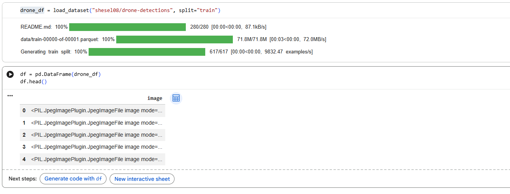

## Deliverables
1. A Hugging Face dataset containing the detections/ sample frames (Parquet format). - https://huggingface.co/datasets/shesel08/drone-detections

2. Output tracking videos (one per test input) uploaded to your personal YouTube channel and embedded in your README.

**Output folder**

/output - This has 2 videos tracking 617 frames & 553 total track(s) spawned and are uploaded in YouTube.

https://youtu.be/8OgKr5ET1SU
https://www.youtube.com/watch?v=19xCafzyD54

## 3. A README.md in your submission repository covering:
### 3.1 Dataset choice and detector configuration.

Training dataset - https://universe.roboflow.com/project/drone-object-detection-5twsu/dataset/1
Train set - 2005 Images
Valid Set - 573 Images
Test Set - 285 Images

1. Downloaded the test videos using yt-dlp.

2. Created 24 clips when drone is visible using ffmpeg. 

3. Created frames 1/5 fps which resulted in 684 frames for both test videos. 

4. After training the model, 617/684 frames had detections and were saved to /detections folder.

#### Experiments
With yolo8 model - 61 detections (notebook - assignment_3_yolo8.ipynb)

With yolo26 model - 172 detections (notebook - assignment_3_yolo26.ipynb)

With RT-DETR model - 617 detections (notebook - assignment_3_RT_DETR.ipynb, output and detections folder correspond to this model). Hence use RT-DETR model for detections.

### Kalman filter state design and noise parameters.
The filter uses a 4-dimensional state vector representing the bounding box center position and it's firts-order velocity.

Motion model:

[[1, 0, dt, 0],
[0, 1, 0, dt],
[0, 0, 1,  0],
[0, 0, 0,  1]]

Observation Matrix:

[[1, 0, 0, 0],
[0, 1, 0, 0]]

Measurement Noise - 10.0
Process Noise - 0.1
Initial uncertainty - 100.0

### Failure cases and how the tracker handles missed detections.
When the detector does not produce a bounding box for an active track, the Kalman filter is not updated. Instead only the predict() method is called propagating the state forward using the constant-velocity motion model. This means the tracker continues to estimate the drone's position from it's last known velocity even when the detector fails. The estimated center shifts linearly until a new measurement corrects it. 

Each track carries a misses counter that increments by 1 for every consecutive frame with no matching detection. If misses > max_misses (default: 5), the track is removed from the active set. This prevents stale tracks from persisting indefinitely when the drone genuinely leaves the scene.

**Failed cases**

1. Small/distance drone - Detector confidence is below 0.25, no bbox is produced. 

2. Fast motion between frames - IoU between predicted box and new detection falls below iou_threshold=0.3

3. Drone re-enters after long absence - Pruned track cannot be re-linked